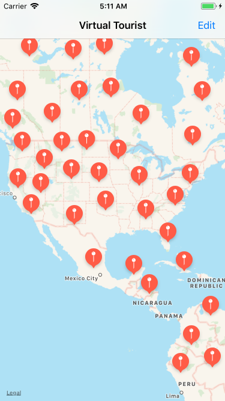
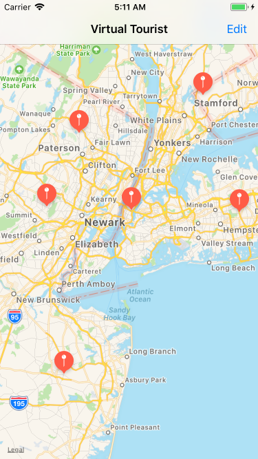
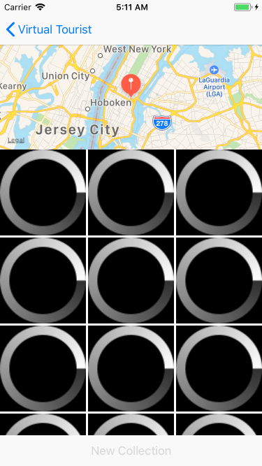
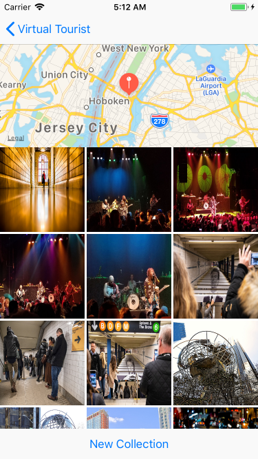
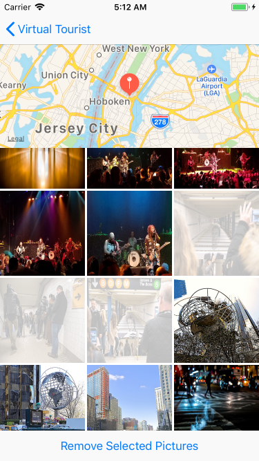
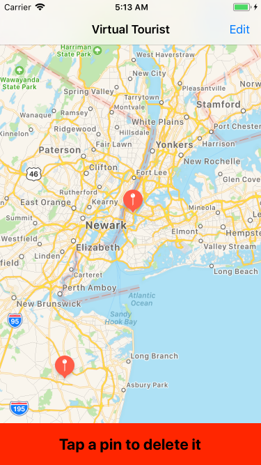

# Virtual Tourist

## Introduction
**Virtual Tourist** is an app that downloads and stores images from Flickr. The app allows users to drop pins on a map, which can then be tapped on to download pictures for that location. It will persist both the pictures and the location of the pin on the map in memory so the user doesn't have to redownload pictures everytime the user taps on a pin.

## Usage
* Able to navigate anywhere in the world and view pictures from there with a simple long press gesture!
* Download pictures for safe keeping and even delete the ones you don't want.
* Delete pins and there associated pictures if the map is getting to full.

## Screenshots

